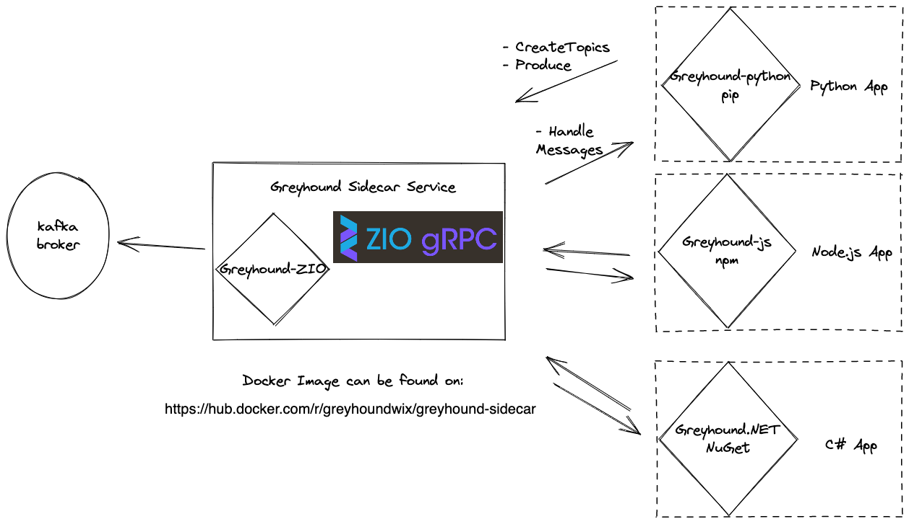

# Greyhound Sidecar

Sidecar app wraps [Greyhound Open Source](https://github.com/wix/greyhound#readme).<br/>
It can communicate with various client SDKs, and gives easy access to produce and consume messages over kafka.

> 📝 Note:  
> The open source version of Greyhound is still in the initial rollout stage, so the APIs might not be fully stable yet.

## Available Client SDKs

- Python
- JavaScript
- .Net
- More APIs coming soon...

## Sidecar APIs

### Create Topics

  Create Kafka Topics without any boilerplate - simply pass the topic name. Multiple topics can be created in a single API call
```
message CreateTopicsRequest {
  repeated TopicToCreate topics = 1;
}

message TopicToCreate {
  string name = 1;
  google.protobuf.Int32Value partitions = 2;
}
```

### Register Endpoint

  In order to be able to receive notifications to consume, Sidecar needs to know where to send consumed messages to. Pass gRPC host and port
```
message RegisterRequest {
 string host = 1;
 string port = 2;
}
```

In the response you receive a `registration_id`, you will need it to consume messages later.

```scala
message RegisterResponse {
  string registration_id = 1;
}
```

### Produce Messages

```
message ProduceRequest {
  string topic = 1;
  google.protobuf.StringValue payload = 2;
  oneof Target {
    string key = 3;
  }
  map<string, string> custom_headers = 4;
}
```


### Start Consuming

This API will create kafka consumers:
* Use the `registraion_id` you got from `Register`
* Consumer - Handles one message per request
* BatchConsumer - Handles batch of messages per request

```
message StartConsumingRequest {
  repeated Consumer consumers = 1;
  repeated BatchConsumer batch_consumers = 2;
  string registration_id = 3;
}

message Consumer {
  string id = 1;
  string group = 2;
  string topic = 3;
  oneof RetryStrategy {
    NoRetry no_retry = 4;
    BlockingRetry blocking = 5;
    NonBlockingRetry non_blocking = 6;
  }
}

message BatchConsumer {
  string id = 1;
  string group = 2;
  string topic = 3;
  oneof RetryStrategy {
    NoRetry no_retry = 4;
    BlockingRetry blocking = 5;
  }
  map<string, string> extraProperties = 6;
}
```

### Retry policies

#### NoRetry
  * Don't retry failed messages
```
message NoRetry {
}
```

#### BlockingRetry
  * Will not proceed with the next message until the current is successful.
  * For use cases where events must be processed successfully in-order in all circumstances, set consumer to retry indefinitely.
  * Interval in milliseconds.
```
message BlockingRetry {
  int32 interval = 1;
}
```
#### NonBlockingRetry
  * Retry topic will be created for each interval (Intervals in milliseconds)
  * Partitions set the number of partitions per retry topic.
  * Messages that throw exceptions will still be committed to Kafka, and they are resent to a dedicated topic which is comprised from the original topic name, the consumer group id and the retry attempt.
  * Processing order is lost when using this retry mechanism.
```
message NonBlockingRetry {
  repeated int32 intervals = 1;
  google.protobuf.Int32Value partitions = 2;
}
```

## Sidecar User API

### Handle Messages

  Sidecar app will send below gRPC request to the endpoint that was set in `Register` API 
```
message HandleMessagesRequest {
  string group = 1;
  string topic = 2;
  repeated Record records = 3;
}

message Record {
  int32 partition = 1;
  int64 offset = 2;
  google.protobuf.StringValue payload = 3;
  map<string, google.protobuf.StringValue> headers = 4;
  google.protobuf.StringValue key = 5;
}
```

# Greyhound Sidecar Architecture 


